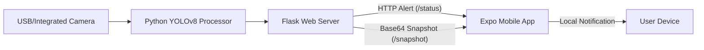

# YOLO Eye: Real-time Person Detection & Mobile Alert System

A professional IoT security solution that integrates **YOLOv8** object detection with a **React Native (Expo)** mobile application. The system monitors a camera feed, detects humans in real-time, and sends immediate push alerts to a mobile device over the local network. It also features a live preview of the camera feed on the mobile device.

---

## 🚀 Features

- **Real-time AI Detection**: Leverages YOLOv8 (You Only Look Once) for high-accuracy human detection.
- **Instant Mobile Alerts**: Immediate local notifications triggered on the phone when a person is detected.
- **Live Preview**: View the camera feed directly on your phone with AI-annotated frames (bounding boxes).
- **Snapshot Architecture**: Robust base64 polling system for 100% reliable image delivery on local Wi-Fi.
- **Cross-Platform**: Built with Expo to support both iOS and Android.

---

## 🏗️ Architecture



---

## 🛠️ Setup Instructions

### 1. Backend (Python Server)
1. Install dependencies:
   ```bash
   cd backend
   pip install -r requirements.txt
   ```
2. Run the server:
   ```bash
   python server.py
   ```
   *Note the IP address displayed in the terminal.*

### 2. Mobile App (Expo)
1. Install dependencies:
   ```bash
   cd mobile
   npm install
   ```
2. Start the app:
   ```bash
   npm start
   ```
3. Enter the Backend's IP address in the app and press **"Start Notifications"**.

---

## 📋 Requirements

- **Python**: 3.9+
- **Node.js**: 18+
- **Network**: Both laptop and phone must be on the same Wi-Fi network.

---

## 📄 License
This project is licensed under the MIT License - see the LICENSE file for details.
